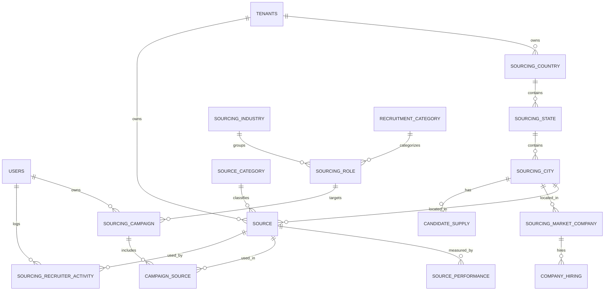

# 2. Complete Database ER Diagram (Node / Express)

**Version:** 2.0  
**Script:** [`sql/V1__sourcing_intelligence_schema.sql`](./sql/V1__sourcing_intelligence_schema.sql)  
**Applied via:** `migrateSourcingIntelligence()` in `server/src/db.ts` + `scripts/migrate-sourcing-intelligence.sql`

Lives in existing schema (`harmirecruit`). All sourcing tables include `tenant_id → tenants(id)`.

## 2.1 ER (Mermaid)

## 2.2 Naming vs ATS collisions

| Sourcing table | Why not reuse |
|----------------|---------------|
| `sourcing_country` / `sourcing_state` / `sourcing_city` | New geo masters (ATS uses free-text locations) |
| `sourcing_role` | Distinct from job titles on `jobs` |
| `sourcing_market_company` | ATS `companies` = client accounts |
| `sourcing_campaign` | New concept |
| `sourcing_recruiter_activity` | ATS `activities` = candidate feed |
| `source` / `source_category` / `source_performance` | New |

Recruiter identity = existing **`users`** (`recruiter_user_id INTEGER`).

## 2.3 Table inventory (25)

Geo: `sourcing_country`, `sourcing_state`, `sourcing_city`  
Talent: `recruitment_category`, `sourcing_industry`, `sourcing_role`, `qualification`, `experience_level`, `salary_range`  
Sources: `source_category`, `source`, `source_role`, `source_industry`, `source_experience_level`, `source_language`, `source_tag`, `source_performance`  
Ops: `sourcing_campaign`, `campaign_source`, `sourcing_recruiter_activity`, `recommendation_run`  
Market: `sourcing_market_company`, `company_hiring`, `candidate_supply`

## 2.4 City intelligence & Source intelligence

Unchanged functionally from v1 (population, colleges, BPO density, night shift, quality rating, member counts, M2M targets, etc.) — see SQL file columns.

## 2.5 Index strategy

- All FKs + `(tenant_id, status)` on hot tables
- Unique per tenant where codes/names must be unique
- `source_performance(tenant_id, source_id, city_id, role_id)`
- `sourcing_recruiter_activity(tenant_id, recruiter_user_id, created_date)`
