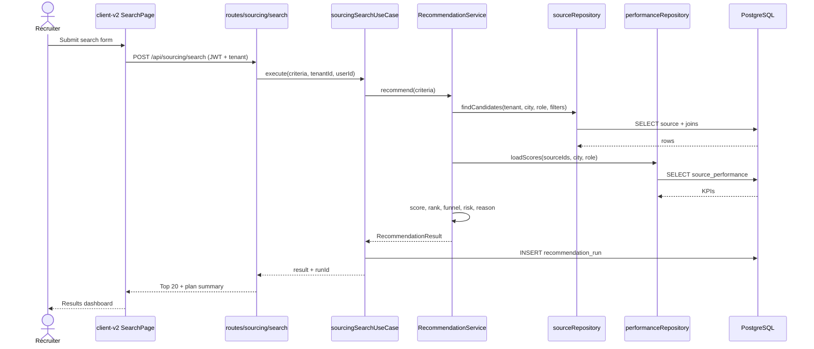
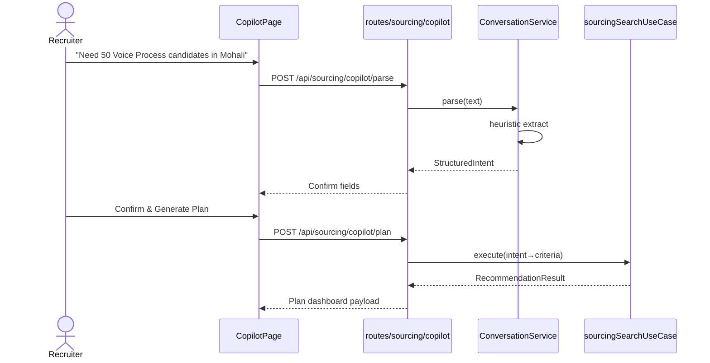
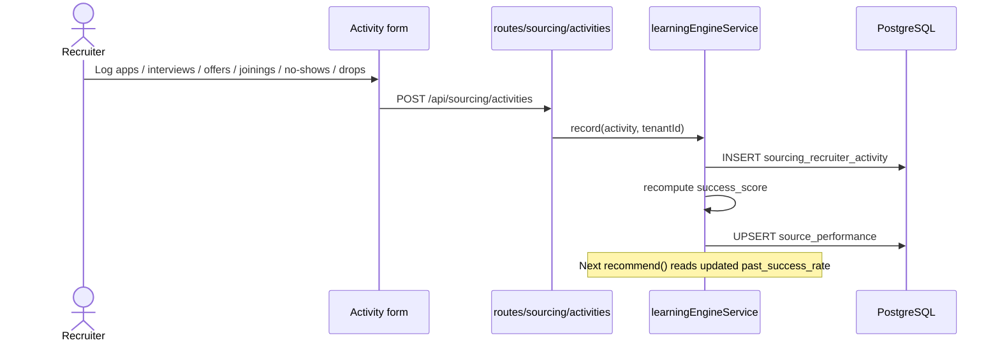
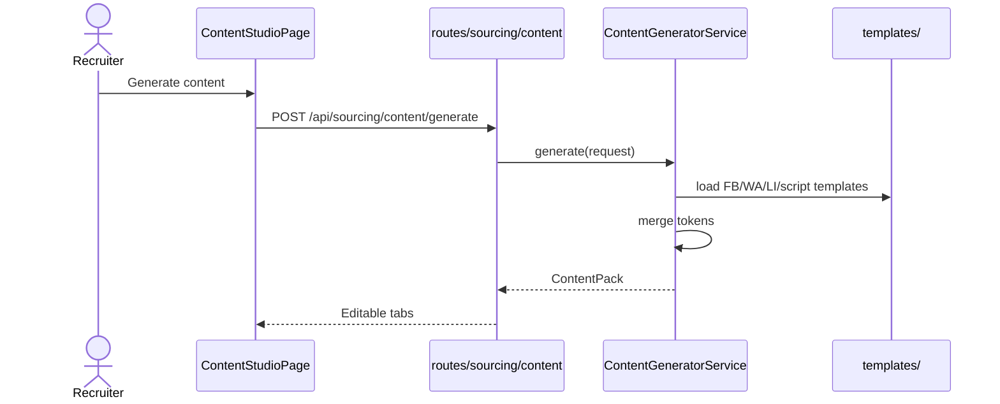
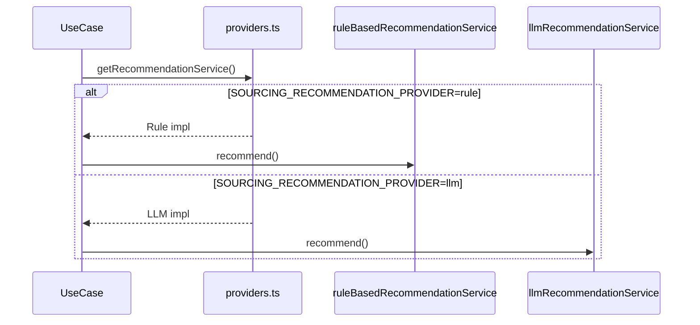

# 10. Sequence Diagrams (Node / Express)

**Version:** 2.0

## 10.1 Structured Search → Recommendations

## 10.2 Copilot NL → Plan

## 10.3 Learning Loop

## 10.4 Content Generation

## 10.5 Future LLM Swap

