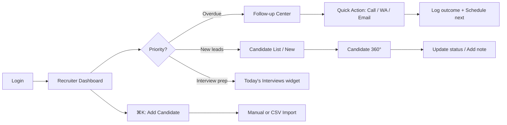
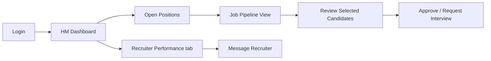
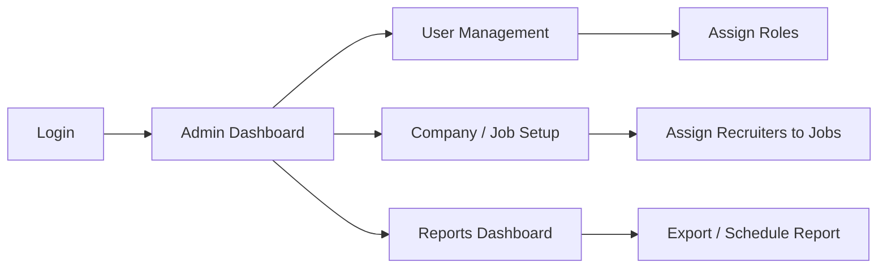
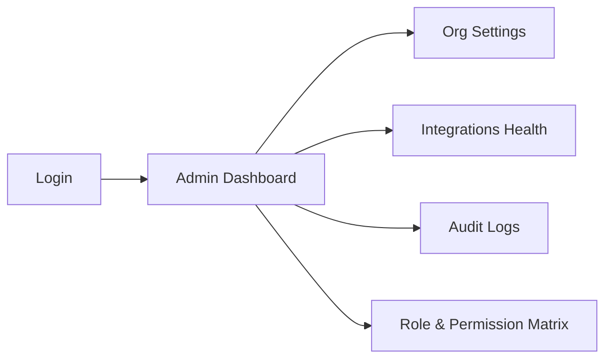

# AIOS Recruitment CRM — Phase 1 Enterprise Wireframes

**Version:** 2.0 (Enterprise)  
**Status:** Low-fidelity wireframes — pending approval before high-fidelity  
**Scope:** Phase 1 only (no backend, no API, UX/UI only)  
**Design benchmark:** HubSpot · Salesforce · Monday.com · Linear · Notion · ClickUp

---

## Table of Contents

1. [Complete Sitemap](#1-complete-sitemap)
2. [Information Architecture & Navigation](#2-information-architecture--navigation)
3. [Design System (Phase 1)](#3-design-system-phase-1)
4. [User Journeys by Persona](#4-user-journeys-by-persona)
5. [Global Shell & Patterns](#5-global-shell--patterns)
6. [Screen Wireframes (Phase 1)](#6-screen-wireframes-phase-1)
7. [Workflow Gaps & Recommendations](#7-workflow-gaps--recommendations)
8. [Click-Path Audit (2–3 Click Rule)](#8-click-path-audit-23-click-rule)
9. [Micro-Interactions & Keyboard Shortcuts](#9-micro-interactions--keyboard-shortcuts)
10. [Phase 2 Preview (Out of Scope)](#10-phase-2-preview-out-of-scope)
11. [Approval Checklist](#11-approval-checklist)

---

## 1. Complete Sitemap

```
AIOS Recruitment CRM
│
├── AUTH (Unauthenticated)
│   ├── /login
│   ├── /forgot-password
│   ├── /reset-password/:token
│   └── /sso/callback
│
├── DASHBOARDS (Role-routed after login)
│   ├── /dashboard                    → Recruiter (default)
│   ├── /dashboard/hiring-manager
│   ├── /dashboard/admin
│   └── /dashboard/executive          → Phase 2
│
├── CANDIDATES
│   ├── /candidates                   → All Candidates (list)
│   ├── /candidates/new               → Manual add
│   ├── /candidates/import            → CSV upload
│   ├── /candidates/import/validate   → Import validation
│   ├── /candidates/:id               → 360° detail view
│   ├── /candidates/new               → New candidates queue
│   ├── /candidates/follow-ups        → Redirect to Follow-up Center
│   ├── /candidates/duplicates
│   ├── /candidates/joined
│   ├── /candidates/tenure
│   └── /candidates/blacklisted
│
├── JOBS
│   ├── /jobs                         → Job list
│   ├── /jobs/new
│   └── /jobs/:id
│
├── PEOPLE
│   ├── /recruiters                   → Recruiter management
│   ├── /recruiters/:id
│   ├── /hiring-managers
│   ├── /hiring-managers/:id
│   └── /companies
│       └── /companies/:id
│
├── FOLLOW-UP CENTER
│   └── /follow-ups                   → Dedicated workspace
│
├── REPORTS
│   ├── /reports                      → Reports dashboard
│   └── /reports/:reportId            → Drill-down (Phase 1: 3 core reports)
│
├── SETTINGS
│   ├── /settings                     → Org settings hub
│   ├── /settings/profile             → User profile
│   ├── /settings/team
│   ├── /settings/roles
│   ├── /settings/notifications
│   └── /settings/integrations
│
└── GLOBAL UTILITIES (Overlay / Persistent)
    ├── ⌘K Command Palette
    ├── Global Search
    ├── Quick Actions (+)
    └── Notification Center
```

**Phase 1 screen count:** 17 primary screens + 4 modal/drawer flows

---

## 2. Information Architecture & Navigation

### 2.1 Primary Sidebar (Collapsible, 240px → 64px icon-only)

| Section | Items | Phase |
|---------|-------|-------|
| **Home** | Dashboard | P1 |
| **Candidates** ▾ | All · New · Follow-ups · Duplicates · Joined · Tenure · Blacklisted | P1 (All + New in P1; rest linked, minimal views) |
| **Jobs** | All Positions | P1 |
| **People** | Recruiters · Hiring Managers · Companies | P1 |
| **Follow-up Center** | — | P1 |
| **Communication** ▾ | WhatsApp · Email · AI Calling · SMS | P2 |
| **Automation** | — | P2 |
| **Reports** | — | P1 |
| **Analytics** | — | P2 |
| **Calendar** | — | P2 |
| **Tasks** | — | P2 |
| **Templates** | — | P2 |
| **AI Assistant** | Floating + sidebar entry | P2 |
| **Settings** | — | P1 |
| **Administration** | User · Role · Permissions · Audit | P1 (subset) |

**Sidebar behavior:**
- Pin/unpin: `⌘B`
- Active item: left 3px blue bar + tinted background
- Section headers: 11px uppercase, muted
- Badge counts on Follow-ups, New Candidates, Tasks
- Role-based visibility (Recruiter sees subset; Admin sees all)

### 2.2 Top Bar (Persistent, 56px)

```
[≡] [Breadcrumb trail ─────────────────────] [⌘K Search...........] [+ Quick] [🔔 3] [Avatar ▾]
```

### 2.3 Breadcrumb Convention (Every Screen)

Format: `Section / Sub-section / Entity Name / Tab (optional)`

| Screen | Breadcrumb |
|--------|------------|
| Recruiter Dashboard | Dashboard |
| Candidate List | Candidates / All Candidates |
| Candidate Detail | Candidates / All Candidates / Raj Kumar |
| Add Candidate | Candidates / Add Candidate |
| CSV Import | Candidates / Import / Upload |
| Import Validation | Candidates / Import / Validate |
| Follow-up Center | Follow-up Center / Today |
| Recruiter List | People / Recruiters |
| Recruiter Detail | People / Recruiters / Priya Sharma |
| Hiring Manager List | People / Hiring Managers |
| Company List | People / Companies / Acme Corp |
| Job List | Jobs / All Positions |
| Job Detail | Jobs / All Positions / Senior Java Developer |
| Reports Dashboard | Reports |
| Settings | Settings / [Active Tab] |
| User Profile | Settings / Profile |
| Login | (none) |
| Forgot Password | Forgot Password |

**Rules:**
- Every segment except last is clickable
- Truncate middle segments with `…` on narrow viewports
- Mobile: collapse to `← Back | Current Page Title`

---

## 3. Design System (Phase 1)

### 3.1 Color Palette — Professional Blue (Dark-mode compatible)

| Token | Light | Dark | Usage |
|-------|-------|------|-------|
| `--color-primary` | `#2563EB` | `#3B82F6` | CTAs, links, active nav |
| `--color-primary-hover` | `#1D4ED8` | `#60A5FA` | Hover states |
| `--color-primary-subtle` | `#EFF6FF` | `#1E3A5F` | Selected rows, chips |
| `--color-success` | `#16A34A` | `#22C55E` | Joined, completed, positive KPI |
| `--color-warning` | `#EA580C` | `#FB923C` | Overdue, pending action |
| `--color-critical` | `#DC2626` | `#EF4444` | Errors, blacklist, missed |
| `--color-info` | `#0284C7` | `#38BDF8` | Informational badges |
| `--color-bg` | `#FFFFFF` | `#0F172A` | Page background |
| `--color-surface` | `#F8FAFC` | `#1E293B` | Cards, table stripes |
| `--color-border` | `#E2E8F0` | `#334155` | Dividers |
| `--color-text-primary` | `#0F172A` | `#F1F5F9` | Headings, body |
| `--color-text-secondary` | `#64748B` | `#94A3B8` | Meta, labels |

**Candidate status colors (left border + badge):**

| Status | Color | Hex |
|--------|-------|-----|
| New | Blue | `#2563EB` |
| Contacted | Purple | `#7C3AED` |
| Screening | Amber | `#D97706` |
| Interview | Indigo | `#4F46E5` |
| Selected | Teal | `#0D9488` |
| Offer | Green | `#16A34A` |
| Joined | Emerald | `#059669` |
| Rejected | Gray | `#6B7280` |
| Blacklisted | Red | `#DC2626` |
| Duplicate | Orange | `#EA580C` |

### 3.2 Typography

**Font stack:** `Inter, -apple-system, BlinkMacSystemFont, 'Segoe UI', sans-serif`

| Level | Size | Weight | Line-height | Use |
|-------|------|--------|-------------|-----|
| Display | 28px | 700 | 1.2 | Dashboard greeting |
| H1 | 24px | 600 | 1.3 | Page titles |
| H2 | 20px | 600 | 1.35 | Section headers |
| H3 | 16px | 600 | 1.4 | Card titles |
| Body | 14px | 400 | 1.5 | Default text |
| Small | 12px | 400 | 1.4 | Meta, timestamps |
| Label | 12px | 500 | 1.2 | Form labels, caps nav |

**Spacing:** 4px base grid — 4, 8, 12, 16, 24, 32, 48, 64

### 3.3 Component Inventory (Phase 1)

| Component | Variants | Notes |
|-----------|----------|-------|
| Button | Primary, Secondary, Ghost, Danger, Icon | Min height 36px (44px mobile) |
| Input | Text, Email, Tel, Password, Search, Textarea | Inline validation |
| Select / Dropdown | Single, Multi, Combobox | Keyboard navigable |
| Data Table | Sortable, selectable, sticky header | Virtual scroll >500 rows |
| Status Badge | Pill + dot | Always paired with text |
| Chip / Filter Tag | Removable | Sticky filter bar |
| Card | KPI, List item, Entity | Hover lift 2px |
| Tabs | Underline, Pill | Max 7 visible; overflow menu |
| Side Drawer | 480px / 640px | Candidate quick preview |
| Modal | sm(400) md(560) lg(720) | Focus trap |
| Toast | Success, Error, Info, Undo | 5s auto-dismiss; undo 8s |
| Empty State | Illustration + CTA | Context-specific copy |
| Skeleton | Table row, Card, Profile | Shimmer 1.5s |
| Command Palette | ⌘K | Actions + navigation + search |
| Timeline | Vertical, compact | Candidate activity |
| KPI Widget | Sparkline optional | Click → drill-down |
| Bulk Action Bar | Sticky bottom | Appears on selection |
| File Upload | Drag-drop zone | CSV, resume PDF |
| Pagination | Numbered + page size | 25/50/100 |
| Avatar | 24/32/40/48px | Initials fallback |
| Breadcrumb | Truncating | See §2.3 |
| Progress Stepper | Import wizard | 3 steps |

---

## 4. User Journeys by Persona

### 4.1 Recruiter — Daily High-Volume Workflow



**Morning (≤10 min):** Login → Dashboard scan → Follow-up Center (overdue tab) → Complete 5 follow-ups via inline actions  
**Afternoon:** Candidate List → filter "Needs Attention" → bulk assign / export  
**End of day:** Dashboard → My Performance widget → log remaining follow-ups

### 4.2 Hiring Manager — Pipeline Visibility



**Key goal:** See pipeline health without operational noise. Read-only on most candidate fields; can add HM notes and approve selections.

### 4.3 Admin — Configuration & Oversight



### 4.4 Super Admin — Multi-Tenant / System



*(Super Admin shares Admin Dashboard with elevated widgets: System Health, Integration status, License usage.)*

---

## 5. Global Shell & Patterns

### 5.1 Application Shell (Desktop ≥1024px)

```
┌──────────┬──────────────────────────────────────────────────────────────┐
│          │ TOP BAR: Breadcrumb | ⌘K Search | + Quick | 🔔 | Avatar       │
│ SIDEBAR  ├──────────────────────────────────────────────────────────────┤
│ 240px    │                                                              │
│          │  PAGE HEADER: Title + Primary Actions (right-aligned)        │
│ Dashboard│  ─────────────────────────────────────────────────────────── │
│ Candidat │  FILTER BAR (sticky, where applicable)                       │
│  ├ All   │  ─────────────────────────────────────────────────────────── │
│  ├ New   │                                                              │
│ Jobs     │  MAIN CONTENT AREA                                           │
│ People   │                                                              │
│ Follow-up│                                                              │
│ Reports  │                                                              │
│ Settings │                                                              │
│          │                                                              │
│ [Collapse│                                                              │
└──────────┴──────────────────────────────────────────────────────────────┘
```

### 5.2 Quick Actions Menu (+ button)

| Action | Shortcut | Clicks from anywhere |
|--------|----------|----------------------|
| Add Candidate | `N` | 1 (palette) or 2 (+ menu) |
| Import CSV | — | 2 |
| Schedule Follow-up | `F` | 2 |
| Create Job | — | 2 |
| Log Call | — | 2 |

### 5.3 Command Palette (⌘K)

Sections: **Recent** · **Candidates** · **Jobs** · **Actions** · **Navigation**  
Example: type `"raj"` → Raj Kumar → Enter opens 360° view (1 keystroke after palette)

---

## 6. Screen Wireframes (Phase 1)

Each screen follows the 11-point deliverable template.

---

### SCREEN 01 — Login

| # | Deliverable |
|---|-------------|
| **Name** | Login |
| **Purpose** | Authenticate users; route to role-appropriate dashboard |
| **Persona** | All roles |
| **Goals** | Sign in quickly; recover password; SSO for enterprise |
| **Layout** | Split 50/50: left brand panel, right form |

```
┌─────────────────────────┬─────────────────────────┐
│  [Logo] AIOS Recruitment│  Sign in to your account│
│                         │                         │
│  "Hire faster with AI"  │  Email [____________]   │
│  [Illustration]         │  Password [__________]  │
│                         │  ☐ Remember me          │
│  Trusted by 500+ agencies│  [Sign In ──────────]  │
│                         │  ─── or continue with ──│
│                         │  [Google] [Microsoft]   │
│                         │  Forgot password?       │
└─────────────────────────┴─────────────────────────┘
```

| **Components** | Email input, Password input (show/hide), Primary button, OAuth buttons, Link, Checkbox, Error alert |
| **Actions** | Sign in · Forgot password · SSO · (Phase 2: Start trial) |
| **Validation** | Email format; password required; lockout after 5 failures; inline errors |
| **Edge cases** | Expired session redirect; SSO-only org hides password form; maintenance banner |
| **A11y** | Labels not placeholders; focus order top→bottom; error announced via `aria-live` |
| **Mobile** | Single column; brand panel collapses to top banner; full-width inputs; 48px touch targets |

**Clicks to dashboard:** 1 (submit) — ✅

---

### SCREEN 02 — Forgot Password

| # | Deliverable |
|---|-------------|
| **Name** | Forgot Password |
| **Purpose** | Initiate password reset via email |
| **Persona** | All roles |
| **Goals** | Reset access without support ticket |
| **Layout** | Centered card (400px) on neutral background |

```
┌──────────────────────────────────────┐
│  ← Back to Sign in                   │
│  Reset your password                 │
│  Enter email — we'll send a link.    │
│  Email [________________________]    │
│  [Send Reset Link ──────────────]    │
└──────────────────────────────────────┘
```

| **Components** | Card, Input, Primary button, Back link, Success state illustration |
| **Actions** | Submit email · Back to login |
| **Validation** | Valid email format; generic success message (no email enumeration) |
| **Edge cases** | Rate limit (3/hr); SSO-only users see "Contact admin" message |
| **A11y** | Success state moves focus to confirmation message |
| **Mobile** | Full-width card with 16px padding |

**Post-submit state:** "Check your email" + resend link (disabled 60s)

---

### SCREEN 03 — Recruiter Dashboard

| # | Deliverable |
|---|-------------|
| **Name** | Recruiter Dashboard |
| **Purpose** | Single-glance command center for daily recruitment work |
| **Persona** | Recruiter |
| **Goals** | Prioritize follow-ups, interviews, hot candidates; act in ≤3 clicks |

```
┌─ Good morning, Priya ──────────────────────── [+ Quick Actions] ─┐
│ KPI ROW (4 cards, equal width)                                    │
│ ┌──────────┐ ┌──────────┐ ┌──────────┐ ┌──────────┐              │
│ │Follow-ups│ │Interviews│ │New Cands │ │My Joining│              │
│ │ 12 (3 ⚠) │ │ 4 today  │ │ 28       │ │ 2 this wk│              │
│ └──────────┘ └──────────┘ └──────────┘ └──────────┘              │
├───────────────────────────────┬───────────────────────────────────┤
│ TODAY'S TASKS (list)          │ AI RECOMMENDATIONS                │
│ ☐ Call Raj — overdue          │ • Follow up Neha (5d no reply)   │
│ ☐ Send JD to Amit             │ • Move 3 stuck in Screening       │
│ ☐ Confirm interview 2pm       │ [View all →]                      │
├───────────────────────────────┼───────────────────────────────────┤
│ PENDING FOLLOW-UPS (table)    │ MY PERFORMANCE (sparkline)      │
│ Name | Job | Due | Action     │ Calls: 45  F/U: 89%  Join: 3     │
├───────────────────────────────┴───────────────────────────────────┤
│ CANDIDATES NEEDING ATTENTION          │ TODAY'S INTERVIEWS        │
│ (compact table, status colors)        │ (timeline list)           │
├───────────────────────────────────────┴───────────────────────────┤
│ PIPELINE FUNNEL (chart)  │  RECENT ACTIVITY  │  MINI CALENDAR     │
└───────────────────────────────────────────────────────────────────┘
```

| **Components** | KPI cards, Task checklist, Data table (compact), AI panel, Funnel chart, Activity feed, Calendar widget, Leaderboard snippet |
| **Actions** | Click KPI → filtered list · Complete task · Inline Call/WA/Email · Open candidate · Join interview |
| **Validation** | N/A (read-only dashboard) |
| **Edge cases** | Empty state for new recruiter; skeleton on load; stale data indicator |
| **A11y** | KPI cards are buttons with `aria-label`; charts have data table fallback |
| **Mobile** | Single column stack; KPI 2×2 grid; sticky Quick Actions FAB; Tasks first |

**Click paths:**
- Overdue follow-up → action: **2 clicks** (KPI → inline Call)
- Open hot candidate: **2 clicks** (AI rec → candidate)

---

### SCREEN 04 — Hiring Manager Dashboard

| # | Deliverable |
|---|-------------|
| **Name** | Hiring Manager Dashboard |
| **Purpose** | Pipeline visibility, selection approvals, recruiter accountability |
| **Persona** | Hiring Manager |
| **Goals** | Track open roles, review selections, monitor joinings |

```
┌─ Welcome, Anil (Acme Corp) ──────────────────────────────────────┐
│ KPI: Open Positions (8) | In Pipeline (142) | Selections (12)    │
│      Pending My Review (5) | Joinings MTD (3) | Avg Response 4.2h  │
├──────────────────────────────┬─────────────────────────────────────┤
│ OPEN POSITIONS (cards)       │ PIPELINE BY STAGE (stacked bar)     │
│ Java Dev — 24 in pipe — ⚠  │ Applied│Screen│Intrv│Sel│Offer│Join │
│ QA Lead — 11 in pipe         │                                     │
├──────────────────────────────┼─────────────────────────────────────┤
│ PENDING MY APPROVAL          │ RECRUITER PERFORMANCE (my jobs)    │
│ Candidate | Job | Recruiter  │ Priya: 8 sel  |  Ravi: 5 sel       │
│ [Review →]                   │                                     │
├──────────────────────────────┴─────────────────────────────────────┤
│ UPCOMING INTERVIEWS | RECENT JOININGS | RESPONSE TIME TREND       │
└───────────────────────────────────────────────────────────────────┘
```

| **Components** | KPI row, Job cards, Pipeline chart, Approval queue, Recruiter table, Trend chart |
| **Actions** | Review candidate · Approve/Reject selection · Message recruiter · Open job detail |
| **Edge cases** | No open positions → CTA "Contact admin"; read-only if role lacks approval permission |
| **A11y** | Approval buttons have confirm dialog; status not color-only |
| **Mobile** | Approval queue prioritized at top; charts become summary numbers |

---

### SCREEN 05 — Admin Dashboard

| # | Deliverable |
|---|-------------|
| **Name** | Admin Dashboard |
| **Purpose** | Org-wide oversight, user health, system status |
| **Persona** | Admin, Super Admin |
| **Goals** | Monitor team performance, spot bottlenecks, manage config entry points |

```
┌─ Organization Overview ────────────────────────────────────────────┐
│ KPI: Active Recruiters (24) | Total Candidates (12.4K) | Jobs (56)│
│      Placements MTD (18) | System Health ● | Import Queue (2)    │
├──────────────────────────────┬─────────────────────────────────────┤
│ TEAM LEADERBOARD             │ RECRUITMENT FUNNEL (org-wide)       │
│ Rank | Recruiter | Joinings │                                     │
├──────────────────────────────┼─────────────────────────────────────┤
│ QUICK ADMIN LINKS            │ RECENT AUDIT LOG                    │
│ [Users] [Roles] [Companies]  │ User X changed role...              │
│ [Jobs] [Integrations]        │                                     │
├──────────────────────────────┴─────────────────────────────────────┤
│ ALERTS: 3 overdue imports | 1 integration error | 2 inactive users│
└───────────────────────────────────────────────────────────────────┘
```

| **Components** | KPI cards, Leaderboard table, Funnel chart, Quick link grid, Audit feed, Alert banner |
| **Actions** | Navigate to admin modules · Resolve alerts · Export org report |
| **Edge cases** | Super Admin sees multi-org selector (Phase 2); degraded integration warning |
| **A11y** | Alert banner is `role="alert"`; leaderboard sortable via keyboard |
| **Mobile** | Quick links become 2-column grid; audit log collapsible |

---

### SCREEN 06 — Candidate List (All Candidates)

| # | Deliverable |
|---|-------------|
| **Name** | Candidate List |
| **Purpose** | High-volume searchable, filterable candidate registry |
| **Persona** | Recruiter, Admin |
| **Goals** | Find, filter, bulk act on candidates fast |

```
┌─ Candidates / All Candidates ────── [Import CSV] [+ Add Candidate] ┐
│ [🔍 Search name, phone, email, skills...          ] [Filters ▾] [⚙]│
│ STICKY: Status: All ▾ | Job: All ▾ | Recruiter: Me ▾ | [Saved ▾]  │
│ Active: Bangalore ×  |  Java ×  |  [Clear all]                     │
├─────────────────────────────────────────────────────────────────────┤
│ ☐ │ Name ▲      │ Phone    │ Job      │ Status  │ Recruiter│ Updated│
│───┼─────────────┼──────────┼──────────┼─────────┼──────────┼────────│
│ ☐ │ ● Raj Kumar │ +91…     │ Java Dev │ Screening│ Priya   │ 2h ago │
│ ☐ │ ● Neha S    │ +91…     │ QA Lead  │ New ⚠   │ Priya   │ 1d ago │
│ ... (virtual scroll)                                                │
├─────────────────────────────────────────────────────────────────────┤
│ Showing 1-25 of 1,247        [25 ▾]  ← 1 2 3 … 50 →    [Export ▾]  │
└─────────────────────────────────────────────────────────────────────┘

[BULK BAR when selected]: 12 selected | Assign | Change Status | Export | Delete
```

**Quick Preview (drawer on row click / `Space`):**
```
┌─ Raj Kumar ──────────────────────── [Open Full Profile →] ─┐
│ Java Dev · 5 yrs · Bangalore · Score 8.2                    │
│ Status: Screening  [Call] [WhatsApp] [Email] [Follow-up]    │
│ Last activity: WhatsApp sent 2h ago                         │
│ Notes preview...                                            │
└─────────────────────────────────────────────────────────────┘
```

| **Components** | Search, Filter drawer, Saved filters, Data table, Status badges, Bulk bar, Side drawer, Column picker, Pagination |
| **Actions** | Search · Filter · Sort · Select · Bulk assign/status/export · Row → preview · Open full profile · Import · Add |
| **Validation** | Export limit 10K rows warning; bulk max 500 selection |
| **Edge cases** | Zero results empty state; filter persistence in URL; duplicate flag icon on row |
| **A11y** | Table `scope` headers; row selection via Space; announce bulk bar appearance |
| **Mobile** | Card list replaces table; swipe actions (Call, WA); filters in bottom sheet |

**Click paths:**
- Find & open candidate: **2 clicks** (⌘K → Enter) or **2 clicks** (search → row)
- Bulk assign 20 candidates: **3 clicks** (select → bulk → assign)

---

### SCREEN 07 — Candidate Detail (360° View)

| # | Deliverable |
|---|-------------|
| **Name** | Candidate 360° View |
| **Purpose** | Single source of truth for all candidate data and actions |
| **Persona** | Recruiter (edit), HM (notes + approve), Admin (full) |
| **Goals** | Review profile, communicate, update status, schedule follow-ups |

```
┌─ Candidates / All / Raj Kumar ─────────────────────────────────────┐
│ ┌ Avatar ─ Raj Kumar ─ Java Developer ─ Bangalore ─ Score 8.2 ────┐ │
│ │ +91 98xxx  ·  raj@email.com  ·  Source: Naukri  ·  Priya      │ │
│ │ Status: [Screening ▾]  [Call] [WA] [Email] [Follow-up] [⋮ More]│ │
│ └─────────────────────────────────────────────────────────────────┘ │
│ TABS: Profile | Timeline | Resume | Communication | Follow-ups |   │
│       AI Insights | Documents | Interviews | Offers | Joining |     │
│       Tenure | Notes | Activity | Related | Duplicates              │
├─────────────────────────────────────────────────────────────────────┤
│ PROFILE TAB:                                                        │
│ ┌─ Personal ─────────┐  ┌─ Professional ─────┐  ┌─ AI Insights ──┐ │
│ │ DOB, Gender, Loc   │  │ Skills, Exp, CTC    │  │ Match: 87%     │ │
│ │ Education          │  │ Notice, Pref          │  │ Suggested: Call│ │
│ └────────────────────┘  └─────────────────────┘  └─────────────────┘ │
│ TIMELINE (right rail or tab): vertical activity feed                │
└─────────────────────────────────────────────────────────────────────┘
```

| **Components** | Profile header, Status dropdown, Action button group, Tab nav, Info cards, Timeline, Resume viewer, Comm thread embed, AI panel, Notes (split recruiter/HM), Duplicate banner |
| **Actions** | Change status · Log call · Send WA/Email · Schedule follow-up · Add note · Upload doc · Flag duplicate · Merge duplicate · Blacklist |
| **Validation** | Status change requires note (configurable); phone format; blacklist requires reason |
| **Edge cases** | Duplicate detected banner with merge CTA; archived candidate read-only; concurrent edit warning |
| **A11y** | Tab list keyboard nav; resume viewer downloadable; timeline items have timestamps |
| **Mobile** | Header sticky; tabs → horizontal scroll; actions in bottom sheet; FAB for primary action |

**Click paths:**
- Call candidate: **1 click** (header Call button)
- Schedule follow-up: **2 clicks** (Follow-up btn → date picker → save)

---

### SCREEN 08 — Add Candidate (Manual)

| # | Deliverable |
|---|-------------|
| **Name** | Add Candidate |
| **Purpose** | Create single candidate record with validation |
| **Persona** | Recruiter, Admin |
| **Goals** | Fast data entry with duplicate prevention |

```
┌─ Candidates / Add Candidate ─────────────────────────────────────┐
│ Step indicator: (single page form, sections collapsible)           │
│ ┌─ Required ─────────────────────────────────────────────────────┐│
│ │ Full Name* [________]   Phone* [+91________]   Email [______] ││
│ │ Job* [Select job ▾]     Source [Select ▾]     Recruiter [Me ▾] ││
│ └────────────────────────────────────────────────────────────────┘│
│ ┌─ Professional (expand) ────────────────────────────────────────┐│
│ │ Skills [tag input]  Experience [__] yrs  Current CTC [______]  ││
│ │ Expected CTC  Notice Period  Location  Preferred Location     ││
│ └────────────────────────────────────────────────────────────────┘│
│ ┌─ Resume ─────────────────────────────────────────────────────┐│
│ │ [Drag PDF/DOCX here or Browse]                                  ││
│ └────────────────────────────────────────────────────────────────┘│
│ ⚠ Duplicate warning: "Raj K, +91 98xxx" exists [View] [Continue]│
│                              [Cancel]  [Save & Add Another] [Save] │
└─────────────────────────────────────────────────────────────────────┘
```

| **Components** | Form sections, Tag input, Job combobox, File upload, Duplicate alert, Split save buttons |
| **Actions** | Save · Save & add another · Cancel · View duplicate |
| **Validation** | Phone unique (warn); email format; job required; resume max 5MB |
| **Edge cases** | Auto-fill from resume parse (Phase 2); save draft to localStorage |
| **A11y** | Required fields marked; errors linked via `aria-describedby` |
| **Mobile** | Single column; sticky footer with Save |

**Clicks:** Dashboard → Add: **2 clicks** (+ menu → Add Candidate)

---

### SCREEN 09 — CSV Upload

| # | Deliverable |
|---|-------------|
| **Name** | CSV Upload |
| **Purpose** | Bulk import candidates via file |
| **Persona** | Recruiter, Admin |
| **Goals** | Upload file, map columns, proceed to validation |

```
┌─ Candidates / Import / Upload ───────────────────────────────────┐
│ Step 1 of 3: Upload                                               │
│ ┌─────────────────────────────────────────────────────────────┐  │
│ │     📄 Drag & drop CSV or Excel file here                    │  │
│ │     Max 5,000 rows · 10MB                                    │  │
│ │     [Browse Files]    [Download Template ↓]                  │  │
│ └─────────────────────────────────────────────────────────────┘  │
│ Recent imports: file.csv — 234 rows — Completed — Jan 4           │
├───────────────────────────────────────────────────────────────────┤
│ Step 2 preview (after upload):                                    │
│ Column mapping: [CSV Header ▾] → [System Field ▾]  Auto-detected  │
│ Job assignment: [Apply to all: Java Dev ▾]                        │
│ Default recruiter: [Priya Sharma ▾]                               │
│                              [Back]  [Continue to Validation →]   │
└───────────────────────────────────────────────────────────────────┘
```

| **Components** | Stepper, Drop zone, Template link, Mapping table, Selects, Recent imports list |
| **Actions** | Upload · Download template · Map columns · Continue |
| **Validation** | File type (.csv, .xlsx); row limit; required field mapping (name + phone) |
| **Edge cases** | Partial upload fail; encoding detection; empty file error |
| **A11y** | Drop zone keyboard accessible via Browse; progress announced |
| **Mobile** | File picker only (no drag); mapping scrolls horizontally |

---

### SCREEN 10 — Candidate Import Validation

| # | Deliverable |
|---|-------------|
| **Name** | Import Validation |
| **Purpose** | Review errors, duplicates, and confirm import |
| **Persona** | Recruiter, Admin |
| **Goals** | Fix or skip bad rows; merge duplicates; confirm import |

```
┌─ Candidates / Import / Validate ───────────────────────────────────┐
│ Step 3 of 3: Review & Import                                      │
│ Summary: 500 rows | ✓ 412 valid | ⚠ 58 warnings | ✗ 30 errors   │
│ [All] [Errors] [Warnings] [Duplicates]                             │
├─────────────────────────────────────────────────────────────────────┤
│ Row │ Name      │ Phone    │ Issue              │ Action           │
│ 12  │ (empty)   │ +91…     │ Missing name       │ [Fix inline]     │
│ 45  │ Raj K     │ +91…     │ Duplicate of #892  │ [Skip|Merge|New] │
│ 78  │ Amit      │ invalid  │ Invalid phone      │ [Fix inline]     │
├─────────────────────────────────────────────────────────────────────┤
│ ☑ Skip rows with errors   ☑ Auto-merge exact duplicates           │
│                              [Back]  [Import 412 Candidates →]    │
└─────────────────────────────────────────────────────────────────────┘
```

| **Components** | Summary chips, Filter tabs, Validation table, Inline edit, Import options, Progress modal |
| **Actions** | Fix inline · Skip row · Merge duplicate · Import valid · Export error report |
| **Validation** | Cannot import 0 valid rows; confirm dialog for >1000 rows |
| **Edge cases** | Import runs async; email notification on complete; partial import log |
| **A11y** | Issue severity not color-only (icons + text); progress modal focus trap |
| **Mobile** | Card per error row; simplified merge options |

---

### SCREEN 11 — Follow-up Center

| # | Deliverable |
|---|-------------|
| **Name** | Follow-up Center |
| **Purpose** | Dedicated workspace for all follow-up work |
| **Persona** | Recruiter |
| **Goals** | Clear overdue items; log outcomes; schedule next actions |

```
┌─ Follow-up Center / Today ─────────────────────────────────────────┐
│ [Today 12] [Overdue 5⚠] [Upcoming 28] [Completed] [Missed 2]      │
│ View: [List ▾] [Timeline]     Sort: [Due date ▾]   Mine ▾          │
├─────────────────────────────────────────────────────────────────────┤
│ ┌─ Overdue ──────────────────────────────────────────────────────┐ │
│ │ ⚠ Raj Kumar · Java Dev · Due: Yesterday · Call scheduled       │ │
│ │   [📞 Call] [💬 WA] [✉ Email] [✓ Done] [→ Reschedule] [Note]   │ │
│ │   AI: "No response in 5 days — try WhatsApp with JD link"      │ │
│ └────────────────────────────────────────────────────────────────┘ │
│ ┌─ Today ────────────────────────────────────────────────────────┐ │
│ │ ○ Neha Shah · QA Lead · Due: 2:00 PM · WhatsApp follow-up      │ │
│ │   [actions...]                                                    │ │
│ └────────────────────────────────────────────────────────────────┘ │
├──────────────────────────┬──────────────────────────────────────────┤
│ TIMELINE (day view)      │ QUICK NOTE (selected item)               │
│ 9am ●──── 12pm ●──── 3pm │ [Log outcome: Connected / No answer...] │
└──────────────────────────┴──────────────────────────────────────────┘
```

| **Components** | Status tabs with counts, Follow-up cards, Inline action buttons, AI suggestion chip, Timeline, Quick note panel, Escalation badge (red if >3 days overdue) |
| **Actions** | Complete · Reschedule · Call/WA/Email · Add note · Bulk complete · Filter by recruiter (admin) |
| **Validation** | Complete requires outcome selection; reschedule requires date |
| **Edge cases** | Missed tab for auto-closed items; escalation notifies team lead |
| **A11y** | Overdue announced; action buttons have text labels |
| **Mobile** | Tab bar bottom; swipe right = complete; swipe left = reschedule |

**Clicks:** Complete follow-up with call log: **2 clicks** (Call → outcome Done)

---

### SCREEN 12 — Recruiter Management

| # | Deliverable |
|---|-------------|
| **Name** | Recruiter Management |
| **Purpose** | Admin view of recruiter roster and performance snapshot |
| **Persona** | Admin, Super Admin |
| **Goals** | Add/edit recruiters, assign jobs, view workload |

```
┌─ People / Recruiters ─────────────────────── [+ Add Recruiter] ──┐
│ [Search...]  Status: Active ▾  Team: All ▾                        │
├─────────────────────────────────────────────────────────────────────┤
│ Name          │ Email         │ Active Jobs │ Candidates │ Join MTD│
│ Priya Sharma  │ priya@…       │ 8           │ 342        │ 3  ●    │
│ Ravi Kumar    │ ravi@…        │ 5           │ 198        │ 1       │
├─────────────────────────────────────────────────────────────────────┤
│ Click row → Recruiter Detail Drawer                               │
│ ┌─ Priya Sharma ──────────────────────────────────────────────┐  │
│ │ Performance mini-dashboard | Assigned jobs | Activity        │  │
│ │ [Edit] [Deactivate] [Reassign candidates]                    │  │
│ └──────────────────────────────────────────────────────────────┘  │
└─────────────────────────────────────────────────────────────────────┘
```

| **Components** | Search, Filters, Data table, Status dot, Detail drawer, Performance mini-KPIs |
| **Actions** | Add · Edit · Deactivate · View performance · Reassign workload |
| **Validation** | Deactivate requires candidate reassignment; email unique |
| **Edge cases** | Deactivated recruiter's candidates show "Unassigned" badge |
| **A11y** | Table sortable; deactivate has confirmation modal |
| **Mobile** | Card list; tap opens full-screen detail |

---

### SCREEN 13 — Hiring Manager Management

| # | Deliverable |
|---|-------------|
| **Name** | Hiring Manager Management |
| **Purpose** | Manage HM accounts and company associations |
| **Persona** | Admin |
| **Goals** | Link HMs to companies and jobs |

```
┌─ People / Hiring Managers ──────────────── [+ Add HM] ───────────┐
│ Name         │ Company      │ Open Jobs │ Pending Reviews │ Status │
│ Anil Mehta   │ Acme Corp    │ 8         │ 5               │ Active │
│ Sara Joshi   │ TechStart    │ 3         │ 0               │ Active │
└─────────────────────────────────────────────────────────────────────┘
```

| **Components** | Table, Company combobox, Job assignment multi-select, Invite email modal |
| **Actions** | Add HM · Assign company · Link jobs · Send portal invite · Deactivate |
| **Validation** | Must belong to ≥1 company; email unique |
| **Edge cases** | HM with no jobs sees empty dashboard guidance |
| **A11y** | Invite modal form labels |
| **Mobile** | Card layout |

---

### SCREEN 14 — Company Management

| # | Deliverable |
|---|-------------|
| **Name** | Company Management |
| **Purpose** | Client/company registry for staffing agency model |
| **Persona** | Admin, Recruiter (read) |
| **Goals** | Maintain company records, contacts, active jobs |

```
┌─ People / Companies ──────────────────────── [+ Add Company] ────┐
│ [Search companies...]  Industry ▾  Status: Active ▾               │
├─────────────────────────────────────────────────────────────────────┤
│ CARD GRID (3 col):                                                │
│ ┌─────────────────┐ ┌─────────────────┐ ┌─────────────────┐        │
│ │ Acme Corp       │ │ TechStart       │ │ Global Services │        │
│ │ IT · Bangalore  │ │ SaaS · Pune     │ │ BPO · Mumbai    │        │
│ │ 8 open jobs     │ │ 3 open jobs     │ │ 12 open jobs    │        │
│ │ HM: Anil Mehta  │ │ HM: Sara Joshi  │ │ HM: 2 assigned  │        │
│ │ [View →]        │ │ [View →]        │ │ [View →]        │        │
│ └─────────────────┘ └─────────────────┘ └─────────────────┘        │
└─────────────────────────────────────────────────────────────────────┘

Company Detail: Info | Contacts | Jobs | Placements | Documents | Notes
```

| **Components** | Search, Filter chips, Company cards, Detail tabs, Contact table |
| **Actions** | Add company · Edit · Add contact · View jobs · Archive |
| **Validation** | Company name unique; GST/PAN format (optional) |
| **Edge cases** | Archive blocked if open jobs exist |
| **A11y** | Cards keyboard focusable |
| **Mobile** | Single column cards |

---

### SCREEN 15 — Job / Position Management

| # | Deliverable |
|---|-------------|
| **Name** | Job / Position Management |
| **Purpose** | Create and manage open positions |
| **Persona** | Admin, Recruiter (assigned jobs) |
| **Goals** | Track openings, assign recruiters, monitor pipeline per job |

```
┌─ Jobs / All Positions ────────────────────── [+ Create Job] ─────┐
│ [Search...]  Company ▾  Status: Active ▾  Recruiter ▾  [Kanban|List]│
├─────────────────────────────────────────────────────────────────────┤
│ LIST VIEW:                                                        │
│ Job Title      │ Company   │ Openings │ Pipeline │ Recruiter │ Urgency│
│ Sr Java Dev    │ Acme      │ 3        │ 24       │ Priya     │ 🔴    │
│ QA Lead        │ TechStart │ 1        │ 11       │ Ravi      │       │
├─────────────────────────────────────────────────────────────────────┤
│ JOB DETAIL (on click):                                            │
│ Tabs: Overview | Pipeline | Candidates | HM | Analytics | History  │
│ Overview: JD editor, skills required, salary range, locations      │
└─────────────────────────────────────────────────────────────────────┘
```

| **Components** | View toggle (list/kanban), Job table, Urgency badge, Detail tabs, JD rich text, Assignment dropdown |
| **Actions** | Create job · Edit · Clone · Close · Assign recruiter · View pipeline |
| **Validation** | Title + company required; close job prompts candidate disposition |
| **Edge cases** | Urgent jobs pinned top; closed jobs hidden by default |
| **A11y** | Urgency has text label not just color |
| **Mobile** | List only; job detail full screen |

---

### SCREEN 16 — Reports Dashboard

| # | Deliverable |
|---|-------------|
| **Name** | Reports Dashboard |
| **Purpose** | Self-serve analytics and export hub |
| **Persona** | Admin, HM (filtered), Recruiter (own data) |
| **Goals** | View KPIs, drill down, export reports |

```
┌─ Reports ────────────────────────────── [Date: Last 30 days ▾] ────┐
│ [Saved Reports ▾]  [+ Custom Report]                              │
├─────────────────────────────────────────────────────────────────────┤
│ REPORT CARDS (grid):                                                │
│ ┌──────────────────┐ ┌──────────────────┐ ┌──────────────────┐     │
│ │ Recruiter Perf   │ │ Recruitment      │ │ Offer Acceptance │     │
│ │ [Chart preview]  │ │ Funnel           │ │ [Chart preview]  │     │
│ │ [Open →]         │ │ [Open →]         │ │ [Open →]         │     │
│ └──────────────────┘ └──────────────────┘ └──────────────────┘     │
├─────────────────────────────────────────────────────────────────────┤
│ DRILL-DOWN VIEW (example: Recruiter Performance):                   │
│ [Chart: bar]  |  [Table: sortable]  |  [Export CSV ▾ Excel PDF]  │
│ Click bar → filter table → click row → recruiter detail             │
└─────────────────────────────────────────────────────────────────────┘
```

**Phase 1 reports (3 core):**
1. Recruiter Performance
2. Recruitment Funnel
3. Offer Acceptance Rate

| **Components** | Date range picker, Report cards, Chart (bar/line/funnel), Data table, Export dropdown, Saved reports |
| **Actions** | Open report · Filter date · Drill down · Export · Save report config |
| **Validation** | Date range max 1 year; export rate limit |
| **Edge cases** | Insufficient data empty state; large export async email |
| **A11y** | Chart data table toggle; export buttons labeled |
| **Mobile** | Report cards stack; table horizontal scroll |

---

### SCREEN 17 — Settings

| # | Deliverable |
|---|-------------|
| **Name** | Settings Hub |
| **Purpose** | Org and personal configuration |
| **Persona** | All (scoped by role) |
| **Goals** | Configure preferences, team, integrations |

```
┌─ Settings ─────────────────────────────────────────────────────────┐
│ LEFT NAV (200px)     │ CONTENT AREA                                │
│ ─ Profile            │                                             │
│ ─ Notifications      │  (Active section content)                   │
│ ─ Team               │                                             │
│ ─ Roles & Permissions│                                             │
│ ─ Candidate Fields   │                                             │
│ ─ Status Workflow    │                                             │
│ ─ Integrations       │                                             │
│ ─ Branding           │                                             │
│ ─ Security           │                                             │
│ ─ Billing (Admin)    │                                             │
└──────────────────────┴─────────────────────────────────────────────┘
```

**Phase 1 settings sections:** Profile · Notifications · Team · Roles (basic) · Security

| **Components** | Settings sidebar, Form groups, Toggle switches, Role matrix (simplified) |
| **Actions** | Save preferences · Invite team member · Configure 2FA |
| **Validation** | Password strength; role change confirmation |
| **Edge cases** | Unsaved changes warning on navigate away |
| **A11y** | Settings nav is `<nav>` with `aria-current="page"` |
| **Mobile** | Settings nav becomes top horizontal scroll tabs |

---

### SCREEN 18 — User Profile

| # | Deliverable |
|---|-------------|
| **Name** | User Profile |
| **Purpose** | Personal account management |
| **Persona** | All roles |
| **Goals** | Update info, password, preferences, view own stats |

```
┌─ Settings / Profile ───────────────────────────────────────────────┐
│ ┌ Avatar (upload) ─┐  Priya Sharma                                 │
│ │     PS           │  Recruiter · Bangalore Team                   │
│ └──────────────────┘  priya@agency.com                            │
│ TABS: Personal | Security | Preferences | My Stats               │
│ Full Name [________]  Phone [________]  Timezone [IST ▾]          │
│ Language [English ▾]  Theme [System ▾]                             │
│ MY STATS: Calls 234 | Follow-ups 89% | Joinings 12 | Rank #3      │
│                                        [Save Changes]              │
└─────────────────────────────────────────────────────────────────────┘
```

| **Components** | Avatar upload, Profile form, Theme toggle, Stats KPI row |
| **Actions** | Update profile · Change password · Upload photo · Switch theme |
| **Validation** | Image max 2MB; phone format |
| **Edge cases** | OAuth users may not have password section |
| **A11y** | Avatar upload has text alternative |
| **Mobile** | Full width form; stats below fold |

---

## 7. Workflow Gaps & Recommendations

### 7.1 Gaps Identified (Phase 1 → Phase 2)

| Gap | Impact | Recommendation |
|-----|--------|----------------|
| No Communication Center in P1 | Recruiters jump between modules | Embed WA/Email/Call in Candidate 360° + Follow-up Center inline actions |
| No Calendar module | Interview scheduling fragmented | "Today's Interviews" widget links to Phase 2 calendar; P1 uses modal scheduler |
| No Automation | Manual follow-up tracking | AI suggestions in Follow-up Center as interim |
| Kanban pipeline separate from list | Two views to maintain | Job detail includes kanban tab; global list is primary in P1 |
| No tenure tracking UI | Post-joining invisible | "Joined Candidates" list with basic tenure columns in P1 lite |
| Duplicate merge flow complex | Data quality risk | Import validation + banner on 360° view covers P1 |

### 7.2 Effort-Reduction Recommendations

1. **Unified Action Bar** — Call, WA, Email, Follow-up on every candidate touchpoint (list drawer, 360° header, follow-up card). *Saves 1–2 clicks per action.*

2. **⌘K as primary navigation** — Power users never touch sidebar. *Target: 80% of searches via palette.*

3. **Sticky filter persistence** — URL-encoded filters + saved presets. *Eliminates re-filtering.*

4. **Inline editing** — Status change in list row dropdown without opening 360°. *Saves 2 clicks.*

5. **Smart defaults** — New candidate auto-assigns current user, current date, "New" status.

6. **Batch import with merge rules** — Default "skip errors, merge exact duplicates" reduces validation time.

7. **Dashboard as inbox** — Tasks + Follow-ups + AI recs act as prioritized queue, not decorative widgets.

8. **Role-based landing** — Login routes directly to role dashboard (no generic home).

9. **Quick Preview drawer** — Space bar on list row; never force full page for scan work.

10. **Undo toast** — Status change, bulk assign show 8-second undo.

---

## 8. Click-Path Audit (2–3 Click Rule)

| Task | Path | Clicks |
|------|------|--------|
| Login → Dashboard | Submit | 1 ✅ |
| Find candidate by name | ⌘K → type → Enter | 2 ✅ |
| Call candidate | 360° → Call | 1 ✅ |
| Log follow-up complete | Follow-up Center → Done | 2 ✅ |
| Add candidate manually | + → Add Candidate → Save | 3 ✅ |
| Import CSV | Candidates → Import → Upload → Validate → Import | 4 ⚠ → Mitigate: + menu → Import (3 clicks to upload) |
| Bulk assign 50 candidates | List → select → Bulk → Assign | 3 ✅ |
| HM approve selection | HM Dashboard → Pending → Review → Approve | 3 ✅ |
| Admin add recruiter | People → Recruiters → Add → Save | 3 ✅ |
| Export report | Reports → Open → Export CSV | 3 ✅ |
| Change own password | Avatar → Profile → Security → Save | 3 ✅ |

**CSV import** is the one flow at 4 clicks to complete — acceptable for infrequent bulk operation; shortcut via Quick Actions reduces to 3.

---

## 9. Micro-Interactions & Keyboard Shortcuts

### 9.1 Interaction Catalog

| Interaction | Behavior | Duration |
|-------------|----------|----------|
| Button hover | translateY(-1px) + shadow +1 | 150ms ease-out |
| Row hover | Background `--color-primary-subtle` | 100ms |
| Card hover | Border → primary, shadow +1 | 200ms |
| Drawer open | Slide from right + backdrop fade | 250ms ease-out |
| Modal open | Scale 0.95→1 + fade | 200ms |
| Toast enter | Slide up + fade | 200ms |
| Skeleton | Shimmer gradient loop | 1.5s infinite |
| Status change | Badge color crossfade + toast with undo | 300ms |
| Tab switch | Underline slide | 150ms |
| Bulk bar | Slide up from bottom | 200ms |

### 9.2 State Patterns

| State | Pattern |
|-------|---------|
| Loading | Skeleton matching layout shape |
| Empty | Illustration + headline + primary CTA |
| Error | Inline banner + retry button; toast for transient |
| Success | Toast with checkmark; undo where reversible |
| Confirm | Modal for destructive; inline for benign |

### 9.3 Keyboard Shortcuts (Phase 1)

| Shortcut | Action | Scope |
|----------|--------|-------|
| `⌘K` / `Ctrl+K` | Command palette | Global |
| `⌘B` | Toggle sidebar | Global |
| `N` | New candidate | Global (palette) |
| `F` | Schedule follow-up | Candidate context |
| `/` | Focus search | List pages |
| `Esc` | Close drawer/modal | Overlay |
| `Space` | Quick preview | Candidate list |
| `↑↓` | Navigate rows | Lists |
| `Enter` | Open selected | Lists |
| `⌘S` | Save form | Forms |
| `?` | Shortcuts help | Global |

---

## 10. Phase 2 Preview (Out of Scope)

- Executive Dashboard
- Communication Center (WhatsApp, Email, SMS, AI Calling)
- Automation Builder
- Analytics (advanced)
- Calendar & Tasks modules
- AI Assistant (floating)
- Tenure tracking (full)
- Gamification & leaderboards (expanded)
- Mobile call screen
- High-fidelity Figma mockups

---

## 11. Approval Checklist

Before high-fidelity mockups, confirm:

- [ ] Information architecture and sidebar structure approved
- [ ] All 18 Phase 1 screens reviewed
- [ ] Role-based dashboard content validated with stakeholders
- [ ] Candidate 360° tab order confirmed
- [ ] Follow-up Center workflow matches team process
- [ ] Import validation rules agreed
- [ ] Reports priority (3 core) confirmed
- [ ] Design system color shift (blue primary) approved
- [ ] Mobile priorities ranked
- [ ] Click-path audit acceptable

**Next step after approval:** High-fidelity mockups in Figma using design tokens from §3, starting with Recruiter Dashboard → Candidate List → Candidate 360° → Follow-up Center.

---

## 12. SaaS Multi-Tenancy Extension

See **`SAAS_ARCHITECTURE.md`** for full specification. Implemented in React (`TenantContext`, org switcher, platform admin, billing).

| Layer | Implementation |
|-------|----------------|
| Tenant isolation | `tenant_id` on all rows (backend); `X-Tenant-Slug` header (frontend) |
| Workspace login | `{slug}.aios.app` or workspace field on login |
| Plans | Starter · Pro · Enterprise with feature gates |
| Platform admin | `/platform`, `/platform/tenants` for super_admin |
| Org settings | `/settings/organization`, `/settings/billing` |

---

*Document owner: UX/Product Design · AIOS Recruitment CRM · Phase 1 v2.0*
